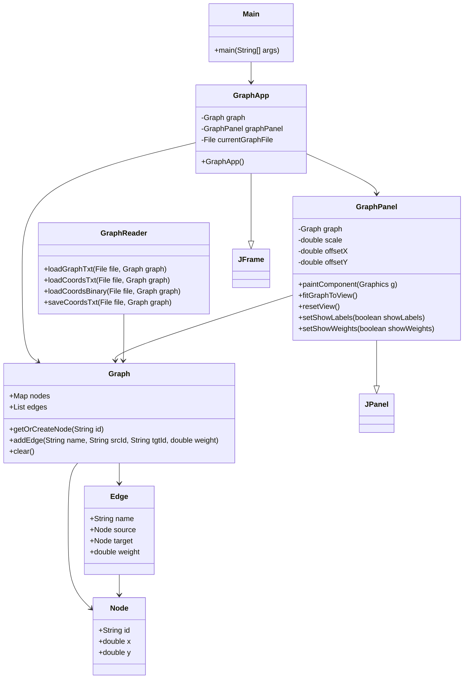

# Dokumentacja końcowa części Java

## A. Opis części Java projektu

Część Java projektu jest aplikacją okienkową Swing przeznaczoną do wizualizacji grafów. Program pozwala użytkownikowi wczytać graf, wczytać lub wygenerować współrzędne wierzchołków, obejrzeć wynik, zmienić widok oraz ręcznie przesunąć wybrane wierzchołki.

Najważniejsze funkcje:

- wczytywanie grafu z pliku TXT,
- wczytywanie współrzędnych z TXT,
- zapisywanie aktualnych współrzędnych do TXT,
- uruchamianie algorytmów zewnętrznego programu C,
- wyświetlanie grafu w komponencie Swing,
- zoom, pan i reset widoku,
- pokazywanie etykiet oraz wag,
- ręczne przeciąganie wierzchołków.

Architektura części Java jest prosta. Klasa `Graph` przechowuje dane, `GraphReader` obsługuje pliki, `GraphPanel` rysuje graf, a `GraphApp` zarządza oknem i akcjami użytkownika.

Ograniczenia:

- Java nie wyznacza układu grafu samodzielnie,
- program C musi być zbudowany przed uruchomieniem algorytmów z GUI,
- Java nie obsługuje binarnego wejścia grafu,
- uproszczony algorytm Barycentric Tutte-style po stronie C jest inspirowany rysowaniem planarnym, ale nie gwarantuje braku przecięć dla każdego grafu.

## B. Projekt interfejsu użytkownika

Główne okno aplikacji jest obiektem `JFrame` i składa się z czterech części:

- pasek menu,
- pasek narzędzi,
- centralny panel grafu,
- dolny pasek statusu.

### Menu `File`

Menu `File` zawiera operacje plikowe:

- `Load graph (TXT)` - wczytuje strukturę grafu,
- `Load coordinates (TXT)` - wczytuje współrzędne tekstowe,
- `Load coordinates (BIN, optional)` - opcjonalnie wczytuje binarne współrzędne C,
- `Save coordinates (TXT)` - zapisuje aktualne pozycje wierzchołków,
- `Exit` - zamyka aplikację.

### Menu `Layout`

Menu `Layout` uruchamia algorytmy z części C:

- `Force-directed layout`,
- `Barycentric Tutte-style Layout`.

Java nie oblicza tych układów. GUI uruchamia skompilowany program C i potem wczytuje wygenerowany plik współrzędnych.

### Menu `View`

Menu `View` zawiera ustawienia prezentacji:

- `Reset view` - dopasowanie całego grafu do panelu,
- `Show labels` - widoczność etykiet wierzchołków,
- `Show weights` - widoczność wag krawędzi.

### Model interakcji

- Kółko myszy powiększa i pomniejsza widok.
- Przeciąganie pustego tła przesuwa widok.
- Przeciąganie wierzchołka zmienia jego współrzędne.
- `Reset view` centruje graf i dobiera skalę tak, aby wszystkie wierzchołki były widoczne.

Wierzchołki i etykiety są rysowane w stałym rozmiarze ekranowym, dzięki czemu przy dużym powiększeniu nie stają się nadmiernie duże.

## C. Podział systemu na moduły

### Uruchomienie aplikacji

Moduł uruchomieniowy to `Main`. Tworzy obiekt `GraphApp` i pokazuje okno.

### Model grafu

Model danych znajduje się w `Graph`, `Graph.Node` i `Graph.Edge`. Model przechowuje strukturę grafu i aktualne pozycje wierzchołków.

### Wejście/wyjście plików

Obsługą plików zajmuje się `GraphReader`. Klasa czyta grafy TXT, współrzędne TXT, opcjonalne współrzędne BIN oraz zapisuje współrzędne TXT.

### Komponent wizualizacji

`GraphPanel` jest komponentem Swing odpowiedzialnym za rysowanie grafu i obsługę myszy.

### Kontroler GUI

`GraphApp` zarządza menu, paskiem narzędzi, paskiem statusu i reakcjami na akcje użytkownika.

### Integracja z programem C

`GraphApp` używa `ProcessBuilder`, aby uruchomić skompilowany program C. Program C zapisuje wynikowe współrzędne, a Java następnie wczytuje je do modelu i odświeża widok.

## D. Główne idee projektowe

W projekcie zastosowano prosty podział podobny do MVC:

- model: `Graph`,
- widok: `GraphPanel`,
- logika aplikacji i obsługa zdarzeń: `GraphApp`.

Aplikacja korzysta z programowania zdarzeniowego Swing. Przyciski, elementy menu i mysz generują zdarzenia, na które reagują listenery.

Wybór algorytmu ma charakter zewnętrzny: Java przekazuje numer algorytmu do programu C. Nie jest to aktywne użycie strategii layoutu w Javie, ponieważ klasy layoutów Java nie są częścią głównego przepływu GUI.

Najważniejsza zasada projektowa to rozdzielenie odpowiedzialności. Java odpowiada za interfejs i wizualizację, a C odpowiada za algorytmy.

## E. Diagram klas

## F. Podsumowanie końcowe

Część Java spełnia rolę graficznego narzędzia do pracy z grafem. Użytkownik może wczytać dane, uruchomić algorytm C, obejrzeć wynik, poprawić położenia wierzchołków i zapisać współrzędne. Kod zachowuje prosty podział odpowiedzialności i nie przenosi algorytmów układu grafu do Javy.
